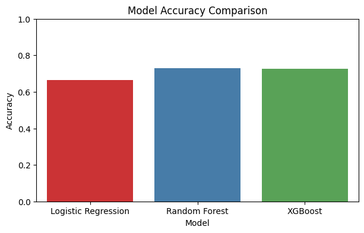
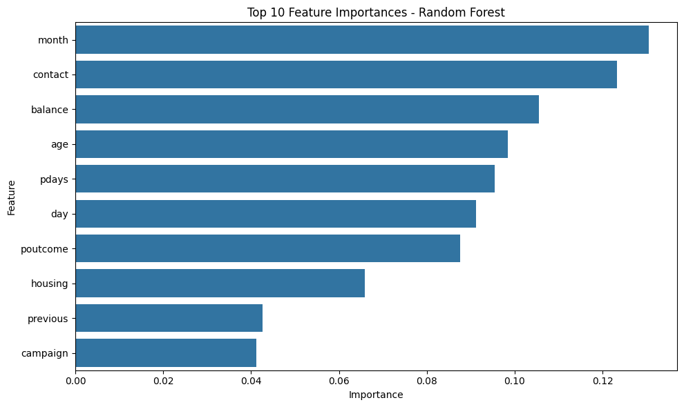
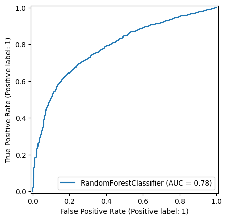
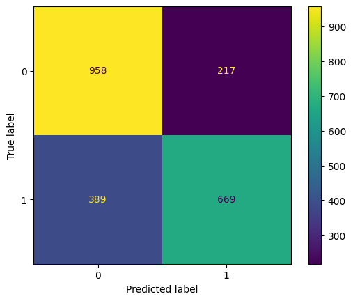

# Bank Marketing Subscription Prediction

Machine Learning project for predicting whether a customer will subscribe to a bank term deposit using demographic information and previous marketing campaign data.

---

## Project Overview

This project develops a binary classification model to help banks identify customers who are more likely to subscribe to a term deposit, enabling more efficient marketing campaigns and reducing unnecessary costs.

---

## Business Problem

Banks spend significant resources contacting customers during marketing campaigns. Predicting which customers are likely to subscribe helps improve campaign efficiency and reduce operational costs.

---

## Dataset

- 11,162 customer records
- 16 input features
- Binary Classification
- Target: **deposit (Yes /No)**

---

## Data Preprocessing

- Missing value & duplicate checking
- Handling **unknown** categorical values
- Feature Engineering (`never_contacted`)
- Winsorization for outlier handling
- Label Encoding
- Standard Scaling (Logistic Regression)
- Stratified Train/Test Split

---

## Models

- Logistic Regression (Baseline)
- Random Forest ✅
- XGBoost

---

## Model Performance

| Model | Accuracy | ROC-AUC |
|-------|---------:|---------:|
| Logistic Regression | 66.4% | 0.718 |
| Random Forest | **72.9%** | **0.783** |
| XGBoost | 72.7% | 0.783 |

Random Forest achieved the best overall performance and was selected as the final model.

---

## Model Evaluation

- Confusion Matrix
- ROC Curve
- Feature Importance
- Cross Validation
- Hyperparameter Tuning (GridSearchCV)

---

## Technologies

- Python
- Pandas
- NumPy
- Matplotlib
- Seaborn
- Scikit-learn
- XGBoost
- SciPy

---
## Visualizations

### Model Comparison

### Feature Importance

### ROC Curve

### Confusion Matrix

---

## Future Work

- Try One-Hot Encoding
- Experiment with CatBoost and LightGBM
- Deploy using Streamlit
- Explore additional feature engineering

---

## Conclusion

Among the evaluated models, Random Forest provided the best balance between Accuracy, Precision, Recall, F1-score, and ROC-AUC. This project demonstrates a complete end-to-end machine learning workflow, from data exploration to model optimization.
